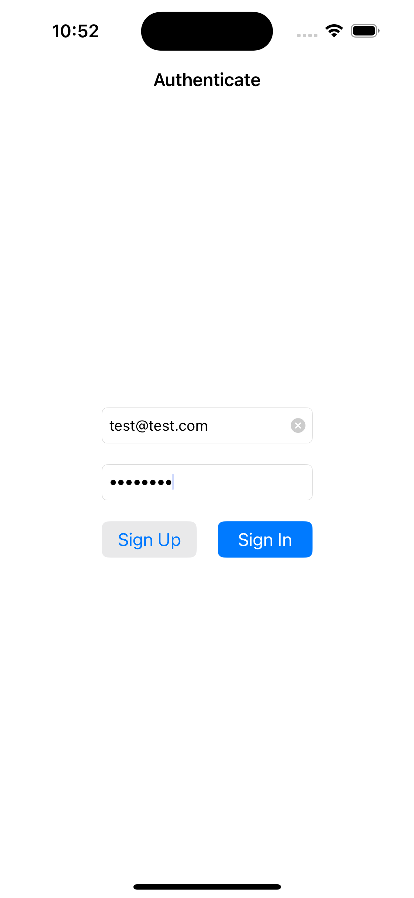
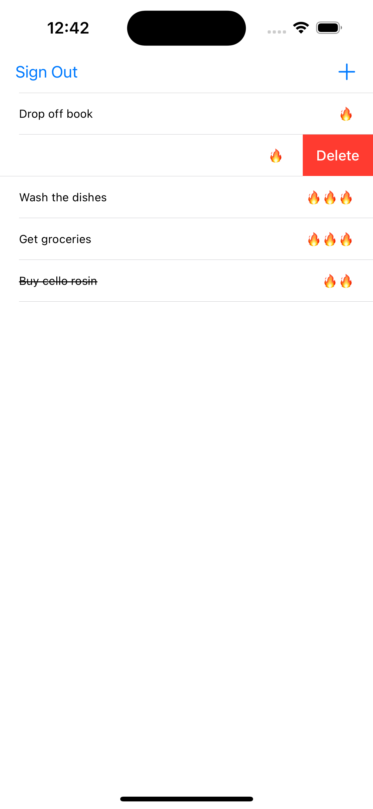
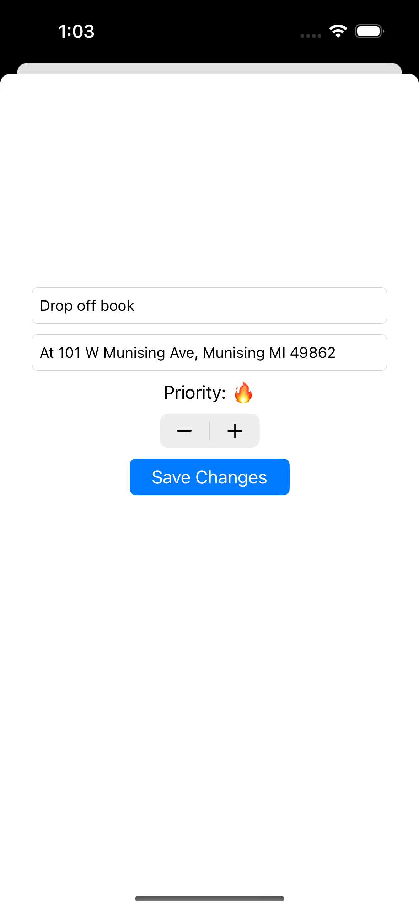

# FireToDo

A rendition of the popular ToDo app using Firebase FireStore and Firebase Authentication for multi-device syncing. 

 
# Features
- Add tasks with title, description, and a priority level
- Mark tasks as complete or incomplete
- Real time synchronization between devices
- Create accounts using Email and password

# Run it
To run, clone this repository, and generate a `.plist` file by creating a new Firebase project. Then, add it to the FireToDo folder. 